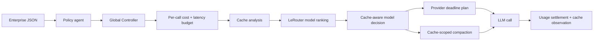

# PromptRail

PromptRail is a cache-aware cost and latency control plane for LangChain agents. It
combines the useful boundaries from LeRouter, CacheManagement, ContextCompaction,
and Provider_Router without coupling their repositories together at runtime.

The system turns enterprise JSON into a validated operating policy, allocates a
budget before every LLM call, chooses a model with LeRouter plus cache economics,
and then prepares provider routing and context compaction concurrently. The
LangChain middleware owns the complete agent lifecycle through `before_agent`,
`wrap_model_call`, `wrap_tool_call`, `after_model`, and `after_agent`.

The source repositories contribute these bounded responsibilities:

| Source | PromptRail responsibility |
| --- | --- |
| LeRouter | Request-specific Gemma ranking and model catalog evidence |
| CacheManagement | Prefix identity, cache value, switch cost, and compactable/protected tags |
| ContextCompaction | Protected-zone enforcement, deterministic reduction, retrieval, and validation |
| Provider_Router | Cheap-first deadline escalation and request/response routing metadata |

## Call flow



For a non-sticky call, the provider exploration window is deterministic:

```text
execution_ms = call_latency_ms
             - max(actual_preparation_ms, controller_reserve_ms + compaction_reserve_ms)
             - safety_margin_ms

slack_ms = max(0, execution_ms - guaranteed_provider_p95_ms)
start_within_ms = min(maximum_exploration_ms, floor(slack_ms * exploration_fraction))
```

If the selected model is the same as the previous call in the session, PromptRail
pins the previous provider and skips cheap-provider exploration. That preserves a
provider-local prompt cache. Otherwise it tries the cheapest safe route before the
computed deadline and escalates to the fastest guaranteed route.

Compaction receives a token target derived from the selected route's input price,
the call's input-dollar budget, cached-token price, and full input length. It can
modify only message indices explicitly marked compactable by the cache coordinator.
System/developer messages, the latest user request, active tool calls, errors, and
the reusable cache prefix are protected.

## Install

Python 3.11 or newer is required.

```bash
uv sync --extra dev
```

The core package only requires Pydantic. Install `promptrail[langchain]` when using
the middleware and `promptrail[http]` for HTTP integrations.

## Runtime SDK

The Runtime SDK gives the PromptRail gateway current application, user, run,
trace, and span identity. It observes execution only. Routing, provider selection,
context compaction, cache management, reasoning control, and budget allocation
remain in the existing server-side systems.

```bash
pip install "promptrail[opentelemetry,openai]"
```

```python
import os

from openai import OpenAI
from promptrail import PromptRail, wrap_openai

PromptRail.init(
    api_key=os.environ["PROMPTRAIL_API_KEY"],
    application="my-agent",
    environment="production",
    user_id=lambda: current_user_id(),
)

client = wrap_openai(
    OpenAI(
        base_url="https://api.promptrail.ai/v1",
        api_key=os.environ["PROMPTRAIL_API_KEY"],
    )
)
```

`wrap_openai` keeps the official OpenAI interface and supplies fresh per-request
headers without monkey-patching the OpenAI package. Generic HTTP clients can use
`inject_headers`, `httpx_request_hook`, or `async_httpx_request_hook` instead.
PromptRail-specific headers are added only for the configured gateway origin.

When OpenTelemetry is installed, `PromptRail.init()` adds a span processor to the
existing `TracerProvider`. It does not replace the provider or its exporters. An
explicit run remains available for applications without a reliable root trace:

```python
from promptrail import event, run

with run(user_id="tenant_3:user_81"):
    event("workflow.stage", name="verification")
    result = agent.invoke(...)
```

Runtime events are queued to a bounded background exporter, batched, retried, and
flushed at shutdown. Instrumentation and export failures are fail-open. Telemetry
defaults to `metadata_only`; raw content capture requires `capture_content=True`.

See [the Runtime SDK guide](docs/runtime-sdk.md),
[architecture](docs/runtime-sdk-architecture.md), and
[event schema](docs/runtime-event-schema.md).


## LangChain integration

`PromptRailMiddleware` requires an explicit model factory. This is the trust
boundary that converts an authorized `PreparedCall` into the concrete LangChain
chat model used for execution:

```python
from langchain.agents import create_agent

from promptrail import PromptRailGateway
from promptrail.langchain import PromptRailContext, PromptRailMiddleware
from promptrail.models import ProviderRoutingMode


class ModelFactory:
    def __init__(self, provider_router_model, direct_models):
        self.provider_router_model = provider_router_model
        self.direct_models = direct_models  # keyed by ProviderRoute.route_id

    def __call__(self, *, prepared, provider_router_headers):
        if prepared.provider.mode is ProviderRoutingMode.DEADLINE:
            # Configure the Provider_Router client with these per-request headers,
            # prepared.model.candidate.model_id, and prepared.provider.total_timeout_ms.
            return self.provider_router_model(
                model_id=prepared.model.candidate.model_id,
                headers=dict(provider_router_headers),
                timeout_ms=prepared.provider.total_timeout_ms,
            )

        # Sticky/direct plans have exactly one authorized route and bypass search.
        route = prepared.provider.routes[0]
        return self.direct_models[route.route_id]


gateway = PromptRailGateway(policy_agent=policy_agent, model_router=model_router)
middleware = PromptRailMiddleware(gateway=gateway, model_factory=ModelFactory(...))

agent = create_agent(
    model=bootstrap_model,  # replaced before each model call
    tools=tools,
    middleware=[middleware],
    context_schema=PromptRailContext,
)

result = agent.invoke(
    {"messages": [{"role": "user", "content": "Inspect the deployment."}]},
    context=PromptRailContext(
        session_id="customer-session-42",
        enterprise_json_paths=("customer-policy-input.json",),
        candidates=model_candidates,
        task="deployment inspection",
        predicted_output_tokens=512,
    ),
)
```

For deadline plans the provided headers use Provider_Router's real request
contract:

- `x-promptrail-start-within-ms` carries the dynamic exploration window.
- `x-promptrail-routing-mode: cheap_first` enables cheap-first escalation.
- `x-promptrail-request-id` correlates the call reservation and route attempt.
- `x-promptrail-policy-version` identifies the control-plane contract.

Provider_Router rejects a zero `start-within` value, so sticky/direct plans omit
that header and must bind their sole route directly. A deadline-routed response
must expose `x-promptrail-route-id` or `x-promptrail-provider` in LangChain response
metadata; otherwise PromptRail fails closed because it cannot settle the correct
provider price or cache state. Configure OpenAI-compatible clients to retain
response headers.

## LeRouter adapters

`LeRouterPolicyGenerator` calls LeRouter's routed execution endpoint and sends an
OpenAI-compatible strict JSON schema. `EnterprisePolicyAgent` then validates the
returned policy locally and binds it to a digest of the source JSON files.

`LeRouterHTTPRanker` calls the deployed catalog ranker for request-specific scores.
Each `ModelCandidate.router_payload` must contain its real
`gemma4_profile_embedding`; PromptRail does not invent embeddings or fall back to a
heuristic ranker. The LeRouter service token and endpoint are deployment inputs.

The candidate catalog is also the authoritative source for provider prices,
latency percentiles, capability flags, and cache behavior. Refresh it outside the
request path when those values change.

## Safety and lifecycle

- Enterprise inputs are bounded to 4 MiB per file and 16 MiB per run.
- Cache state stores prompt hashes and token counts, not prompt content.
- Compacted originals live in a session-scoped retrieval store and are deleted at
  the end of the run. The included store is process-local; production deployments
  can replace it with their existing ContextCompaction retrieval layer.
- Cost and latency are reserved before execution and settled from provider usage.
  Missing billing after an attempted request is charged conservatively.
- Models, providers, capabilities, context windows, and predicted cost/latency are
  hard authorization checks. There is no silent model or ranker fallback.
- The middleware's private state contains only run/call IDs. Full prepared prompts
  remain inside the gateway process.

LangChain runs `after_agent` on successful graph completion. Applications that
catch an uncaught graph exception should explicitly close the captured PromptRail
run with `gateway.finish_run(run_id=..., success=False)` after the final retry or
recovery decision.

## Verification

```bash
uv run ruff check .
uv run pytest -q
uv build
```

The focused suite covers the full controller/cache/router/compaction pipeline,
cache value changing a LeRouter decision, synchronous and asynchronous LangChain
tool loops, provider metadata and usage settlement, strict policy schemas, sticky
provider reuse, retrieval, and cleanup. A live LeRouter check is intentionally not
part of the default suite because it requires credentials and incurs a model call.
