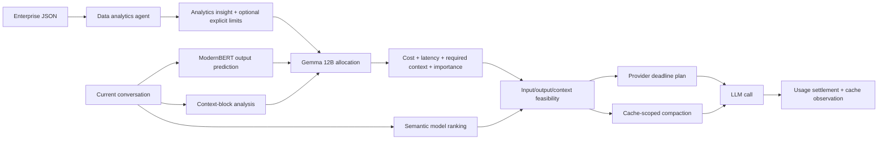

# PromptRail

PromptRail is a cache-aware cost and latency control plane for LangChain agents. It
combines the useful boundaries from LeRouter, CacheManagement, ContextCompaction,
and Provider_Router without coupling their repositories together at runtime.

The system turns enterprise JSON into a validated analytics insight. For every
LLM call, LeRouter's ModernBERT predicts output length while context blocks and
semantic model scores are prepared in parallel. A pinned Gemma 12B controller
then allocates cost, latency, required context, and up to 12 importance overrides.
PromptRail checks input plus output economics before choosing a model, then runs
provider planning and graded inline compaction concurrently. The LangChain middleware owns the complete agent
lifecycle through `before_agent`, `wrap_model_call`, `wrap_tool_call`,
`after_model`, and `after_agent`.

Agent executions are open-ended: PromptRail neither asks for nor invents an
expected number of LLM calls. Aggregate and per-call hard limits are optional and
remain `null` unless the enterprise data explicitly defines them.

The source repositories contribute these bounded responsibilities:

| Source | PromptRail responsibility |
| --- | --- |
| LeRouter | ModernBERT output prediction, request-specific Gemma ranking, and catalog evidence |
| CacheManagement | Prefix identity, cache value, switch cost, and compactable/protected tags |
| ContextCompaction | Importance-weighted inline reduction and boundary validation |
| Provider_Router | Cheap-first deadline escalation and request/response routing metadata |

## Call flow



The Global Controller does not calculate a budget share. It sends a bounded
control request, without the full conversation, to Gemma containing the analytics
insight, call sequence, cumulative spend/latency, tool-call count, full input
token estimate (including tool schemas), predicted output length, optional hard limits,
cache cost signals, typed context blocks, and candidate feasibility evidence. It validates Gemma's schema-v2 structured
response, reserves it exactly, and rejects it rather than clipping it if an
explicit hard limit would be crossed.

For a non-sticky call, the provider exploration window is deterministic:

```text
execution_ms = call_latency_ms
             - max(actual_preparation_ms, controller_reserve_ms + compaction_reserve_ms)
             - safety_margin_ms

slack_ms = max(0, execution_ms - guaranteed_provider_p95_ms)
start_within_ms = min(maximum_exploration_ms, floor(slack_ms * exploration_fraction))
```

If the selected model is the same as the previous call in the session, PromptRail
pins the previous provider and skips cheap-provider exploration. That preserves a
provider-local prompt cache. Otherwise it tries the cheapest safe route before the
computed deadline and escalates to the fastest guaranteed route.

Compaction receives Gemma's required-context target. Deterministic importance is
combined with Gemma's bounded overrides, redundancy, age, and cache invalidation
cost in a weighted water-filling allocation. Protocol text and the latest user
request stay exact; current tool results, errors, tests, and patches receive high
graded importance instead of an all-or-nothing exemption. Reduction is type-aware
and inline-only. No retrieval marker is emitted that the model cannot resolve.

Candidate feasibility prices the required input and predicted output separately,
including cached-input rates, and verifies their sum plus the context window. Cost
and latency allocations become rejection ceilings only when an explicit hard limit
exists. Uncapped runs keep Gemma's required context and settle authoritative usage.

## Install

Python 3.11 or newer is required.

```bash
uv sync --extra dev
```

The core package only requires Pydantic. Install `promptrail[langchain]` when using
the middleware and `promptrail[http]` for HTTP integrations.

## Runtime SDK

The Runtime SDK gives the PromptRail gateway current application, user, run,
trace, and span identity. It observes execution only. Routing, provider selection,
context compaction, cache management, reasoning control, and budget allocation
remain in the existing server-side systems.

```bash
pip install "promptrail[runtime]"
```

```python
import os

from openai import OpenAI
from promptrail import PromptRail, wrap_openai

PromptRail.init(
    api_key=os.environ["PROMPTRAIL_API_KEY"],
    application="my-agent",
    environment="production",
    user_id=lambda: get_current_user_id(),
)

client = wrap_openai(
    OpenAI(
        base_url="https://api.promptrail.ai/v1",
        api_key=os.environ["PROMPTRAIL_API_KEY"],
    )
)
```

`wrap_openai` keeps the official OpenAI interface and supplies fresh per-request
headers without monkey-patching the OpenAI package. Generic HTTP clients can use
`inject_headers`, `httpx_request_hook`, or `async_httpx_request_hook` instead.
PromptRail-specific headers are added only for the configured gateway origin.

When OpenTelemetry is installed, `PromptRail.init()` adds a span processor to the
existing `TracerProvider`. It does not replace the provider or its exporters. An
explicit run remains available for applications without a reliable root trace:

```python
from promptrail import event, run

with run(user_id="tenant_3:user_81"):
    event("workflow.stage", name="verification")
    result = agent.invoke(...)
```

Runtime events are queued to a bounded background exporter, batched, retried, and
flushed at shutdown. Instrumentation and export failures are fail-open. Telemetry
defaults to `metadata_only`; raw content capture requires `capture_content=True`.

The SDK can also normalize PromptRail event batches, JSONL, generic span exports,
and OpenTelemetry JSON into the canonical runtime event schema:

```python
from pathlib import Path

from promptrail import import_historical_traces

history = import_historical_traces(Path("traces.jsonl").read_bytes())
print(history.summary())
```

Remote LangSmith, Langfuse, Braintrust, and Helicone connectors are still under
construction. Source configuration is validated today, but remote synchronization
does not begin until the corresponding control-plane connector is deployed.

See [the Runtime SDK guide](docs/runtime-sdk.md),
[architecture](docs/runtime-sdk-architecture.md), and
[event schema](docs/runtime-event-schema.md).

## Polygres analytics storage

The PromptRail development environment is associated with Polygres project
`p111ad168ce1d4f548eb254d`. Keep these three passwordless values in the ignored
`.env` file:

- `DATABASE_URL` for pooled application analytics traffic;
- `DIRECT_URL` for migrations and schema tooling only;
- `POLYGRES_RUNTIME_URL` for the per-project Runtime API.

Retrieve them through `polygres env`; do not copy a native database password or
Runtime API key into tracked files. The checked-in `.env.example` intentionally
contains names only.

The connection metadata is configured, but the analytics schema is not deployed
yet. LeRouter's existing `001_budget_allocator.sql` targets its older fixed
per-task integer-budget design, so it must not be applied unchanged to
PromptRail's open-ended, Gemma-managed per-call architecture. Schema design and
application remain a separately reviewed migration step.

## LangChain integration

`PromptRailMiddleware` requires an explicit model factory. This is the trust
boundary that converts an authorized `PreparedCall` into the concrete LangChain
chat model used for execution:

```python
from langchain.agents import create_agent

from promptrail import (
    Gemma12BBudgetAllocator,
    Gemma12BHTTPGenerator,
    PromptRailGateway,
)
from promptrail.langchain import PromptRailContext, PromptRailMiddleware
from promptrail.models import ProviderRoutingMode


class ModelFactory:
    def __init__(self, provider_router_model, direct_models):
        self.provider_router_model = provider_router_model
        self.direct_models = direct_models  # keyed by ProviderRoute.route_id

    def __call__(self, *, prepared, provider_router_headers):
        if prepared.provider.mode is ProviderRoutingMode.DEADLINE:
            # Configure the Provider_Router client with these per-request headers,
            # prepared.model.candidate.model_id, and prepared.provider.total_timeout_ms.
            return self.provider_router_model(
                model_id=prepared.model.candidate.model_id,
                headers=dict(provider_router_headers),
                timeout_ms=prepared.provider.total_timeout_ms,
            )

        # Sticky/direct plans have exactly one authorized route and bypass search.
        route = prepared.provider.routes[0]
        return self.direct_models[route.route_id]


budget_allocator = Gemma12BBudgetAllocator(
    Gemma12BHTTPGenerator(
        endpoint_url="https://gemma-controller.example/v1/chat/completions",
        service_token=gemma_service_token,
    )
)
gateway = PromptRailGateway(
    policy_agent=policy_agent,
    budget_allocator=budget_allocator,
)
middleware = PromptRailMiddleware(gateway=gateway, model_factory=ModelFactory(...))

agent = create_agent(
    model=bootstrap_model,  # replaced before each model call
    tools=tools,
    middleware=[middleware],
    context_schema=PromptRailContext,
)

result = agent.invoke(
    {"messages": [{"role": "user", "content": "Inspect the deployment."}]},
    context=PromptRailContext(
        session_id="customer-session-42",
        enterprise_json_paths=("customer-policy-input.json",),
        candidates=model_candidates,
        task="deployment inspection",
    ),
)
```

For deadline plans the provided headers use Provider_Router's real request
contract:

- `x-promptrail-start-within-ms` carries the dynamic exploration window.
- `x-promptrail-routing-mode: cheap_first` enables cheap-first escalation.
- `x-promptrail-request-id` correlates the call reservation and route attempt.
- `x-promptrail-policy-version` identifies the control-plane contract.

Provider_Router rejects a zero `start-within` value, so sticky/direct plans omit
that header and must bind their sole route directly. A deadline-routed response
must expose `x-promptrail-route-id` or `x-promptrail-provider` in LangChain response
metadata; otherwise PromptRail fails closed because it cannot settle the correct
provider price or cache state. Configure OpenAI-compatible clients to retain
response headers.

## LeRouter adapters

`LeRouterPolicyGenerator` calls LeRouter's routed execution endpoint and sends an
OpenAI-compatible strict JSON schema. `EnterprisePolicyAgent` then validates the
returned policy locally and binds it to a digest of the source JSON files.

By default, `PromptRailGateway` constructs `LeRouterHTTPRanker` from the production
environment and calls LeRouter's deployed combined routing worker using its
`infinite_route_v2` contract. The worker runs the real `google/gemma-4-12B`
bi-encoder and computes/caches missing model-profile embeddings server-side. This
is the temporary production path until model-profile embeddings are precomputed
offline; PromptRail does not synthesize embedding vectors or silently use static
scores.

Configure the scoped credential in the runtime environment:

```bash
export PROMPTRAIL_BIENCODEUR_SERVICE_TOKEN="<scoped bearer token>"
```

The checked-in defaults pin the live combined worker URL and deployed model run.
They can be overridden during a reviewed LeRouter deployment:

```bash
export LEROUTER_ROUTING_WORKER_URL="https://<deployed-worker>.modal.run"
export LEROUTER_GEMMA4_ROUTER_RUN_ID="<approved-gemma-router-run>"
```

The bearer token must come from the same secret material as LeRouter's Modal
`promptrail-infinite-biencodeur` secret. Do not commit it. A missing token, changed
contract, different semantic model/run, or incomplete candidate ranking fails
closed. `SuppliedLeRouterRanker` remains available only when explicitly injected,
primarily for deterministic tests.

The LeRouter request timeout is also derived from the current call allocation. It
reserves observed controller time, compaction time, the latency safety margin, and
the fastest available provider's p95 execution time, then gives only the remaining
milliseconds to model routing (subject to the adapter's 30-second ceiling). If no
time remains, the call fails before making the routing request.

`ModelCandidate.router_payload` can supply authoritative `profile_text`, `forces`,
and `benchmark_results`. When omitted, the adapter derives profile text and forces
from the candidate's declared strengths and capabilities; LeRouter still creates
the embedding. A future precomputed-embedding integration should change the wire
contract only after the production endpoint accepts and validates those embedding
records.

The candidate catalog is also the authoritative source for provider prices,
latency percentiles, capability flags, and cache behavior. Refresh it outside the
request path when those values change.

## Gemma budget controller

`Gemma12BBudgetAllocator` pins the per-call decision owner to
`google/gemma-4-12B`. `Gemma12BHTTPGenerator` calls a dedicated
OpenAI-compatible structured-generation endpoint at temperature zero and verifies
the model identity returned by that endpoint. A different model is rejected.

LeRouter's existing Gemma 12B runtime is a fine-tuned bi-encoder that emits model
ranking embeddings; it cannot emit structured budgets. Therefore the allocation
adapter must point at a separate Gemma 12B generation deployment. PromptRail does
not silently route this decision through LeRouter or fall back to a deterministic
budget formula.

The analytics policy supports four nullable explicit caps:

- `hard_agent_cost_limit_usd` bounds aggregate spend, while
  `hard_agent_latency_limit_ms` is a wall-clock deadline for the complete agent
  execution when such bounds truly exist.
- `hard_call_cost_limit_usd` and `hard_call_latency_limit_ms` bound each call.

With all four set to `null`, Gemma still produces every call allocation and the
controller still reserves and settles it; there is simply no invented aggregate
ceiling.

## Safety and lifecycle

- Enterprise inputs are bounded to 4 MiB per file and 16 MiB per run.
- Cache state stores prompt hashes and token counts, not prompt content.
- Compaction is inline-only. PromptRail does not place inaccessible retrieval IDs
  into the provider prompt or retain compacted source text in its default store.
- Gemma allocations are reserved before execution and settled from provider
  usage. Missing billing after an attempted request is charged conservatively.
- Finishing an agent with unsettled call reservations logs an error, charges the
  unresolved allocations conservatively, and completes cleanup without crashing.
- Optional hard limits are enforced only when present. Gemma's allocation is a
  pre-call routing authorization and forecast; authoritative provider usage is
  always settled, and forecast variance does not terminate an otherwise uncapped
  agent run.
- Models, providers, capabilities, context windows, and predicted cost/latency are
  hard authorization checks. There is no silent model or ranker fallback.
- The middleware's private state contains only run/call IDs. Full prepared prompts
  remain inside the gateway process.

LangChain runs `after_agent` on successful graph completion. Applications that
catch an uncaught graph exception should explicitly close the captured PromptRail
run with `gateway.finish_run(run_id=..., success=False)` after the final retry or
recovery decision.

## Verification

```bash
uv run ruff check .
uv run pytest -q
uv build
```

The focused suite covers Gemma-owned open-ended allocation, optional hard-limit
enforcement, the full controller/cache/router/compaction pipeline, cache value
changing a LeRouter decision, synchronous and asynchronous LangChain tool loops,
provider metadata and usage settlement, strict policy schemas, sticky provider
reuse, retrieval, and cleanup. Live Gemma and LeRouter checks are intentionally
not part of the default suite because they require credentials and incur model
calls.
